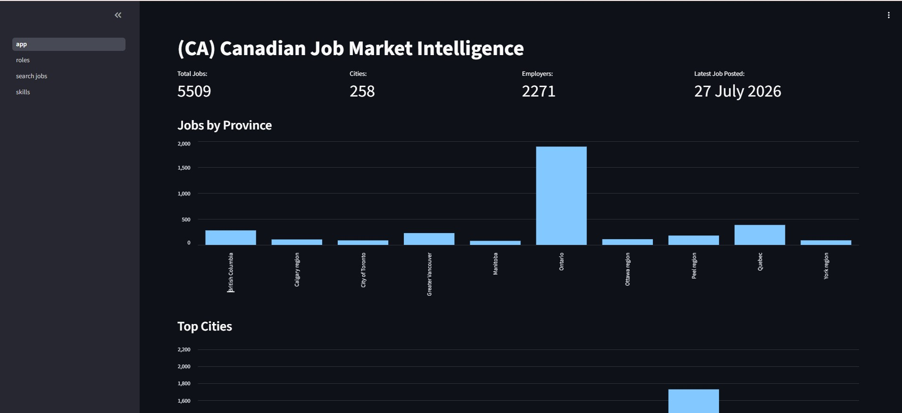
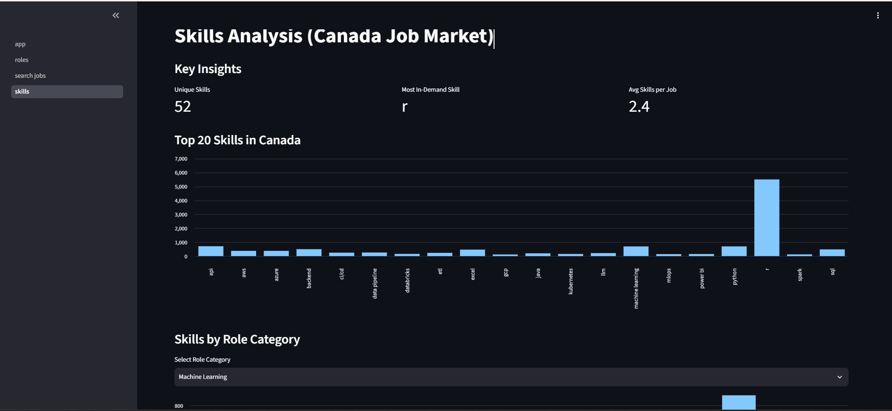
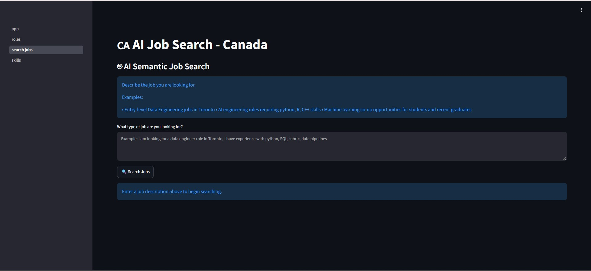

# 🇨🇦 Canadian Job Market Intelligence Platform


An end-to-end **data engineering and AI-powered analytics platform** that automates the collection, processing, storage, and analysis of Canadian technology job market data, delivering labour market insights and AI-powered semantic job search using Retrieval-Augmented Generation (RAG).

The platform is built using modern data engineering practices including API ingestion, ETL processing, PostgreSQL database management, Docker containerization, and Microsoft Azure cloud deployment.

## 🌐 Live Demo

**Live Application:** 
https://canadajobapp2026.agreeablebush-333b8346.eastus.azurecontainerapps.io

Explore the deployed application to interact with the analytics dashboard and AI-powered semantic job search.

## 📸 Application Preview

The platform provides interactive labour market analytics and AI-powered job discovery through a multi-page Streamlit application.

### Labour Market Dashboard



### Skills Analysis



### AI-Powered Semantic Search (RAG)



---

## Project Overview
The Canadian Job Market Intelligence Platform was developed to provide data-driven insights into the Canadian technology job market by collecting real-world job postings and transforming raw employment data into actionable intelligence.

The platform helps users understand:

- Job availability across Canada
- In-demand technical skills
- Hiring trends over time
- Geographic demand
- Role distribution
- Relevant job opportunities based on user queries

---

## System Architecture

                JSearch API
                    |
                Adzuna API
                    |
                    ↓
             Extraction Layer
                    |
                    ↓
          Transformation Layer
     (Cleaning, Validation, Feature Engineering)
                    |
                    ↓
             PostgreSQL Database
                    |
                    ↓
        Streamlit Analytics Application
        (Skills, Roles, Job Search)
                    |
                    ↓
        Embedding + RAG Layer

## Deployment Components

- **Azure Container Registry**
  - Stores Docker images for application deployment

- **Azure Container Apps**
  - Hosts the Streamlit analytics application

- **Azure Database for PostgreSQL Flexible Server**
  - Stores processed job market data

- **Docker**
  - Provides reproducible application environments
---
## Data Engineering Pipeline

### Data Ingestion

Built automated data ingestion workflows to collect job postings from external APIs:

- Integrated JSearch API and Adzuna API
- Automated recurring data collection
- Implemented API handling and error management
- Processed raw job posting responses into structured datasets

### Data Transformation

Developed transformation workflows to prepare raw job data for analytics:

- Cleaned and validated job records
- Removed duplicate postings
- Standardized job titles and locations
- Extracted technical skills from job descriptions
- Created additional features for analytics

### Database Design (PostgreSQL)

Designed and optimized a PostgreSQL database to store structured job market data, including:

- Job details
- Company information
- Locations
- Experience levels
- Role categories
- Extracted skills
- Embeddings

---

## Analytics Dashboard

Built an interactive Streamlit application providing:

- Labour market overview metrics
- Job distribution by province and city
- In-demand skills analysis
- Role-based job insights
- Hiring trend analysis

---

## AI-Powered Search (RAG)

Implemented a Retrieval-Augmented Generation (RAG) workflow to enable natural-language interaction with job market data.

The system:

- Converts job information into vector embeddings
- Stores semantic representations for similarity search
- Embeds user queries
- Retrieves relevant job records based on semantic similarity
- Generates contextual responses using retrieved information

Example:

"I am a Data Engineer looking for opportunities in Toronto. What jobs are available?"

The system retrieves relevant job opportunities based on the user's query.

---

## Technologies Used

### Programming & Data Processing
- Python
- Pandas

### Data Engineering
- ETL Pipeline Development
- API Integration
- Data Cleaning
- Data Transformation
- PostgreSQL
- Data Modeling

### Cloud Technologies
- Microsoft Azure
- Azure Container Apps
- Azure Container Registry
- Azure Database for PostgreSQL Flexible Server

### AI & Machine Learning
- Vector Embeddings
- Retrieval-Augmented Generation (RAG)
- Semantic Search

### Application & Deployment
- Streamlit
- Docker
- Docker compose
- Git/GitHub

---

## Future Enhancements
- Agentic AI career assistant
- Automated resume-to-job matching
- Advanced labour market forecasting
- Real-time job alerts
- Enhanced AI recommendations

---

## Project Structure

```text
Canadian_Job_Platform/

├── pages/
│   ├── skills.py
│   ├── search_jobs.py
│   └── roles.py
│
├── script/
│   └── run.py
│
├── src/
│   ├── etl.py
│   ├── database.py
│   ├── document.py
│   ├── config.py
│   └── job_features.py
│
├── app.py
├── Dockerfile
├── docker-compose.yml
├── requirements.txt
└── README.md
```

## Status

🚀 Production deployment running on Microsoft Azure.

Future development will focus on expanding intelligent career assistance features and scaling the data pipeline.

